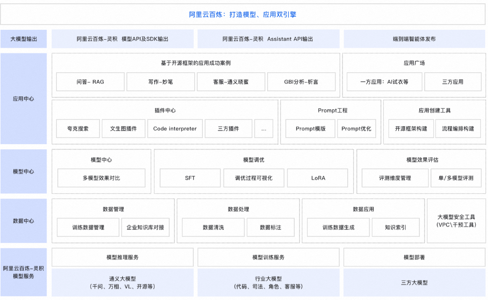

# 基于阿里云百炼，开启智能服务新篇章！🚀🤖

-----

阿里云百炼架构图👇

大家好，从今天起，我将在这个平台上与大家分享一系列关于如何使用阿里云百炼进行Agent搭建的过程记录，其中不免很多错误和不完善，希望抛砖引玉，和大家多多交流。

## 🔍 为什么选择阿里云百炼？

阿里云百炼是国内领先的智能服务开发平台，以其强大的功能和灵活性，为Agent的构建提供了无限可能。无论你是技术小白还是资深开发者，都能在这里找到还算适合你的解决方案。当然国内还有很多其他很好的平台：百度 App Builder、字节扣子等，选择合适的用起来就好。

## 📚 系列内容预告

在未来的361篇笔记中，我会从零开始，记录每一次搭建 Agent 的过程，包括但不限于：

- 账号注册，开通环境
- 基础功能使用
- 简单Agent 流程设计
- 复杂任务的 Agent 设计
- 场景应用实践
- 开放 API 对接（需要开发经验）

## 👨‍🏫 适合人群

无论你是刚入行的新手，还是希望提升智能服务水平的专业人士，这个系列都会给你带来一丝丝的帮助，或者提供一些失败案例，减少入坑。

## 🔗 互动环节

如果你对Agent搭建有任何疑问，或者有特别想要了解的内容，欢迎在评论区留言，我会在后续的笔记中为你一一解答。

---

让我们一起开启这段智能服务的探索之旅吧！记得关注我，不要错过任何一期的精彩内容哦！👀

## SNS

- 😈 小红书 / 即刻：@阿里云百炼
- 🌏 网站-Agent361 ：https://agent361.cn/
- 🌏 网站-自用导航 ：https://soul.icu/
- 🌏 网站-BillowFlow ：https://myinv.cn/
- 🌏 网站-笔记 ：https://mirror.xyz/lua.eth/
