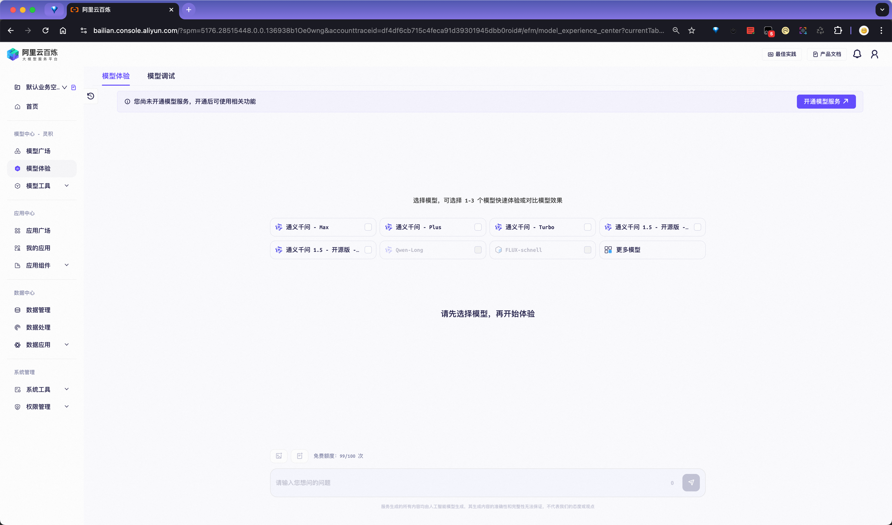

# 🔥🚀 开通百炼平台，轻松玩转AI！
-----

## 引言
- 介绍注册阿里云并开通百炼平台的大致步骤。

## 注册阿里云账号的步骤
1. 访问阿里云官网 https://aliyun.com

2. 选择合适的方式进行注册，我选用手机验证来注册账号。

3. 实名认证账号（使用支付宝进行认证）。

4. 完成认证

## 百炼平台介绍
### 开通百炼平台

1. 访问 https://www.aliyun.com/product/bailian

2. 点击开通服务

3. 这时就可以进行百炼平台的使用了。（如果没有完成实名认证，需要完成实名认证后，才可以使用平台）

### 百炼平台的主要功能介绍
主要包括三大中心：**模型中心、应用中心、数据中心**。
- 模型中心主要进行`大模型`的`开通`、`训练`、`上架`、`测试`等功能。
- ✨ 应用中心罗列了现在平台提供的`应用模板`、`官方应用`、`自定义应用（Agent）`、`插件管理`、`提示词工程`、`流程管理`、`应用评测`等功能。
- 数据中心主要是用于管理模型使用的`训练数据`、内部`知识库文档`等。

后续 Agent 搭建主要使用数据中心和应用中心两大模块。使用的大模型采用默认的 `QWen MAX`

#### 首页
首页概览，可以进行模型选择并体验对话。

#### 模型中心
模型广场，罗列现在百炼平台支持的商用、闭源、开源的大模型，基于这些模型进行大模型能力输出。

使用大模型进行问答或者提供给应用使用，需要开通对应模型，有些模型需要支付费用。

模型开通后，可以进入模型体验，输入问题、提示词，进行模型问答交互。同事可以进行多个模型对比调试。

#### 应用中心
应用中心包含了三大板块：官方应用、应用模板、最佳实践。
- 官方团队的成熟化商业应用，例如：全妙产品、析言、通义法睿、通义听悟等。后面也会基于这几个产品做一些 Agent 应用。
- 应用模板，快速基于模板创建同类别自定义的应用。
- 最佳实践，三个 Agent 类型，API 调用、RAG 应用、Function call 调用。

我的应用，列表展示自定义的 Agent 应用。

插件中心包含了官方提供的几个插件，还可以创建自定义插件，插件需要满足 OpenAPI 规范。

流程编排可以可视化的进行一个复杂流程的编排，然后讲流程发布后，作为插件供应用使用。

提示词工程包含官方提供的提示词，也可以自定义常用的模板，从而在应用中使用。

#### 数据中心
数据管理是非常重要的一环，在于企业内部私有知识，个人私有知识来说至关重要。平台提供了**结构化数据**和**非结构化数据**的上传，平台自动对数据进行**向量化**处理，从而可以提供给应用引用响应的知识库，从而实现 RAG 能力。为大模型归纳推理提供私有知识。

数据管理提供结构化、非结构化两种管理能力。对知识进行不同的分类，提供给**知识索引**模块进行选择，为不同 Agent 可以调用不同分类的知识。

创建知识库索引，选取不同类型的数据，从而构建一个向量知识，供 Agent 使用。

## 结语
- 以上是粗略的对平台进行大致介绍。详细的内容推荐浏览官方文档：
  - [操作指南](https://help.aliyun.com/zh/model-studio/guide/)
  - [最佳实践](https://bailian.console.aliyun.com/?bestPractices=1#/best-practices)
- 完成平台注册和了解平台基本内容后，下一篇我们就可以基于阿里云百炼进行 Agent 搭建和使用了。

## 主题标签
- `#阿里云` `#百炼平台` `#AI技术` `#注册`
