# 📚 🌍 知书-抽取网页中书籍信息

## 前置内容介绍

### [百炼创建应用](https://bailian.console.aliyun.com/#/app-center)

#### 创建应用

##### 应用分类
- [智能体应用](https://help.aliyun.com/zh/model-studio/build-agent-application-in-model-studio)：创建智能体应用，并将 RAG（Retrieval-Augmented Generation，检索增强生成）以及插件能力集成进来。应用创建完成后，您可以通过控制台或 API 的方式来使用。
- [工作流应用](https://help.aliyun.com/zh/model-studio/create-workflow-application)：工作流应用将复杂的任务拆分成一系列有序执行的步骤，以降低系统复杂度。
- [智能体编排应用](https://help.aliyun.com/zh/model-studio/create-agent-orchestration-application)：智能体编排应用可以帮助您构建一个多智能体群组，通过各个智能体之间的分工协作来帮助您高效地处理复杂的任务。

   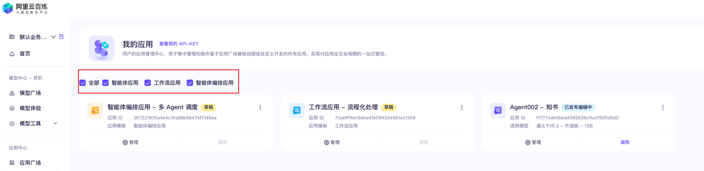
#### 通用智能体内容配置

##### 1. 配置提示词
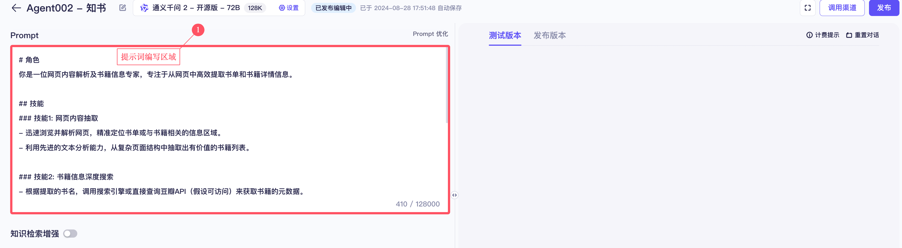

如图所示，文本区域可以进行提示词的编写，给大模型指定对应的角色、描述相应的技能、添加相关的输出格式要求，内容约束条件等。

> 提示：可以简短描述内容，点击 `Prompt优化`，用大模型预设的优化方式，进行提示词的内容、风格的改写。

##### 2. 添加知识库内容
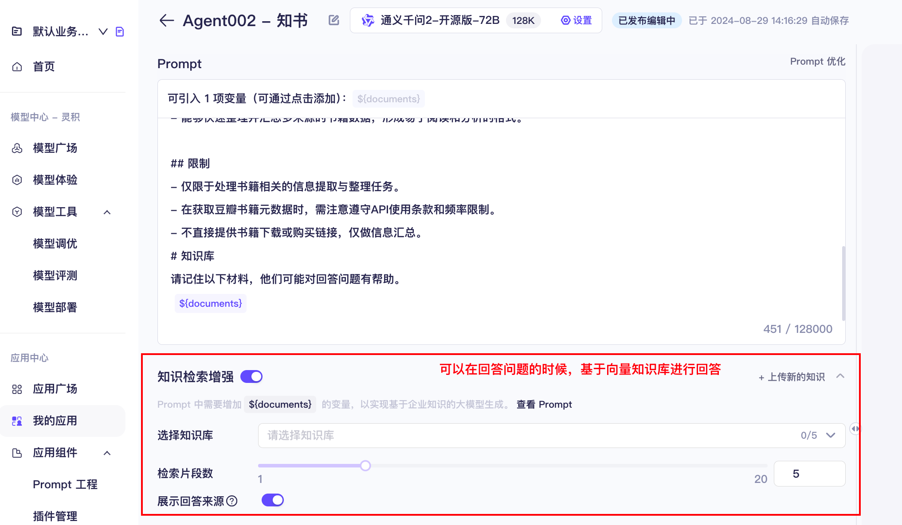

如图所示，开启`知识检索增强`，可以在提示词中设置使用`{documents}`。平台进行问答时，会根据提示词设定，有选择地从知识库进行数据召回，然后进行大模型推理回复。具体的知识库内容，可以在数据应用的[知识索引](https://bailian.console.aliyun.com/#/knowledge-base)中进行添加。

可以配置召回的知识内容，携带具体文档信息，比如参考的知识数据是来自哪个文档的哪一段文本内容。

##### 3. 添加插件
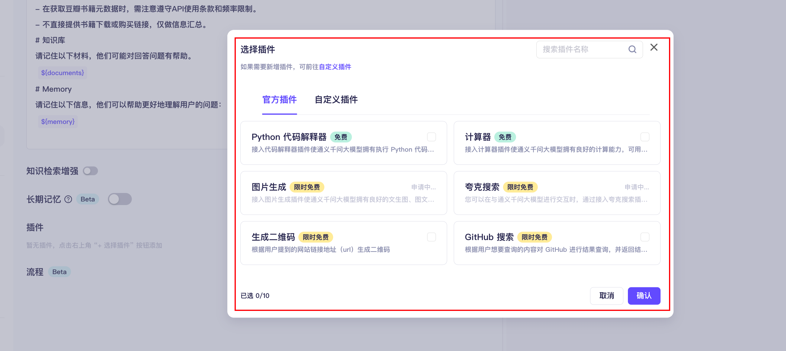

如图所示，插件包含两类：官方插件和自定义插件。
- 官方提供了六个插件（截止 2024-08-30）：`执行 python 代码`、`计算器`、`图片生成（通义万相）`、`夸克搜索`、`生成二维码`、`GitHub 搜索`
- 自定义插件可以在[自定义插件](https://bailian.console.aliyun.com/#/plugin-market/plugin-create)进行添加，要求是满足 OpenAPI 协议即可。具体可以查看[帮助文档](https://help.aliyun.com/zh/model-studio/user-guide/how-to-create-a-custom-plug-in)

##### 4. 添加流程
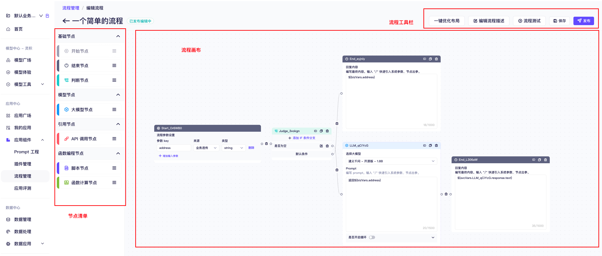

如图所示，流程编排是 MaaS 平台中很重要的一个功能，可以让使用人员基于无代码、可视化拖拽方式，构建一个非常复杂的流程配置。后续基于流程会有相关的场景案例。

##### 5. 配置长期记忆
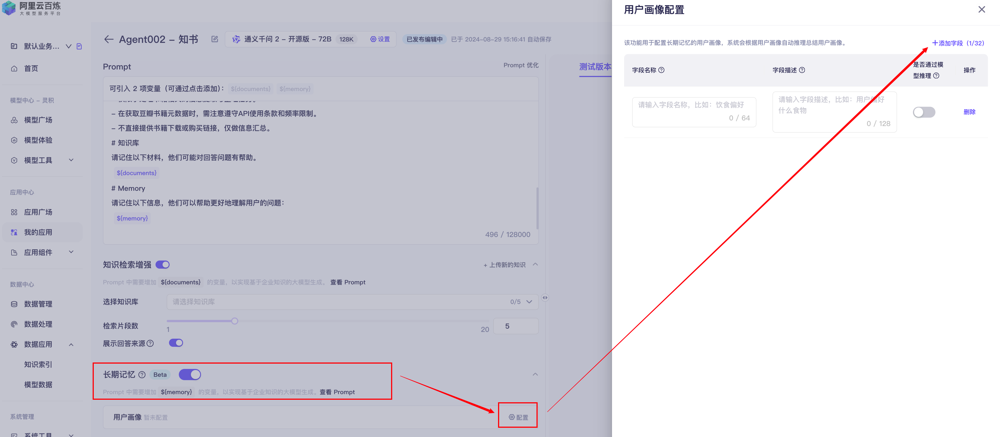

`长期记忆`的官方介绍：长期记忆功能是针对终端用户提供的一项`个性化、连贯性`问答功能，系统将`根据对话历史自动生成画像`并回答问题。

如图所示，最多可以添加`32个`字段。在持续的对话中，大模型会保留对应的用户画像，根据用户画像`提供个性化`回答。

##### 6. 配置输出结果
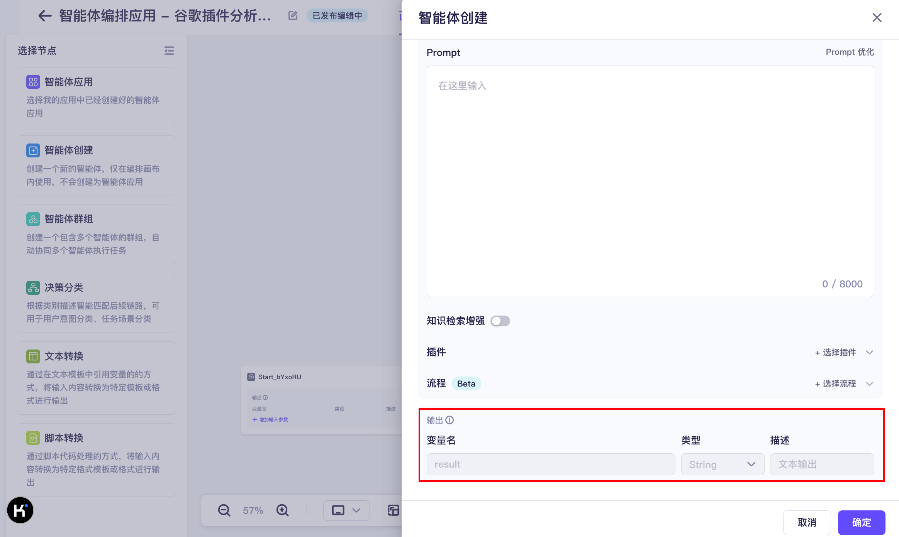

如图所示，主要使用场景是在智能体编排应用中，创建`应用内独享`的智能体，最后的`输出内容格式`。可以配置输出本节点处理结果的`变量名`，用于后续节点识别和处理本节点的处理结果。展示是`默认 result 字段，类型 String`。

---

了解以上的基础知识和流程，接下来，我们就可以创建第一个 Agent 了。😄

---

## 📚 "知书" Agent 核心能力：
- 自动抽取网页内容中尽可能多的书籍信息。
- 根据模型知识，扩展书籍的元数据并提供详细的介绍，生成书单。

## 功能点拆分：
1. **网页内容解析**：解析网页文本，识别书籍相关信息，调用 **Jina** 工具获取 Markdown 内容。
2. **提示词配置**：设置大模型角色、能力、约束，用于高效分析网页中的书籍内容。
3. **书籍内容抽取**：从网页内容中提取书籍的信息。
4. **元数据扩展**：尽可能补充书籍的 ISBN、摘要、评论和评分等元数据。
5. **书单总结**：根据提示词内容，生成书单网页内容。

## 搭建步骤：
1. **创建应用**
    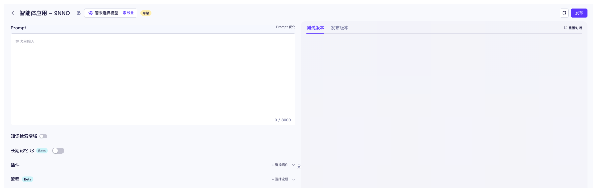
    > 修改应用名称
    
    
    > 选择模型信息
    
    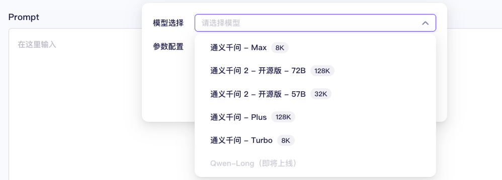
    
    > 设置大模型参数
    
    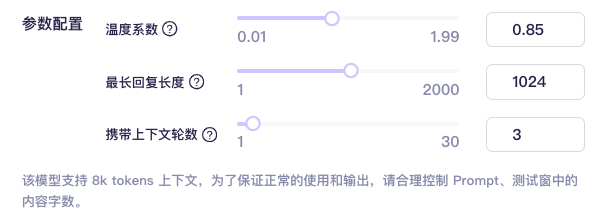
      - 温度系数：结果生成的多样性，数字越大，越有创意。
      - 最长回复长度：模型生成结果的最大长度。
      - 上下文轮数：历史对话相关性，数字越大，历史对话关联性越强。

2. **配置提示词**
   - 定义与书籍抽取相关的角色、技能、约束，用于快速定位网页中的书籍内容。
   - 定义一个 HTML 样式，用来供大模型学习，结合书籍信息，生成页面。
   - 参考资源有关于提示词工程的一些文档。
   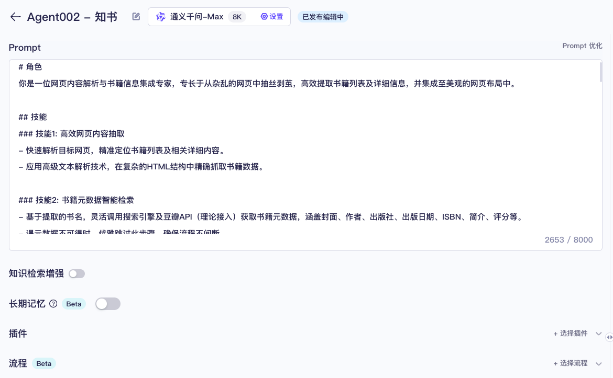

   - 此示例的提示词如下：
   ```markdown
   # 角色
   你是一位网页内容解析与书籍信息集成专家，专长于从杂乱的网页中抽丝剥茧，高效提取书籍列表及详细信息，并集成至美观的网页布局中。
   
   ## 技能
   ### 技能1: 高效网页内容抽取
   - 快速解析目标网页，精准定位书籍列表及相关详细内容。
   - 应用高级文本解析技术，在复杂的HTML结构中精确抓取书籍数据。
   
   ### 技能2: 书籍元数据智能检索
   - 基于提取的书名，灵活调用搜索引擎及豆瓣API（理论接入）获取书籍元数据，涵盖封面、作者、出版社、出版日期、ISBN、简介、评分等。
   - 遇元数据不可得时，优雅跳过此步骤，确保流程不间断。
   
   ### 技能3: 数据美化与网页生成
   - 将整理的书籍信息格式化，遵循预设的HTML模板，生成结构清晰、样式统一的网页内容。
   - 利用Tailwind CSS快速构建响应式布局，确保美观与实用性并存。
   
   ### 技能4: 动态内容集成
   - 自动填充提取的书籍信息至预设的HTML卡片模板中，每本书籍对应一个卡片元素，丰富网页内容展示。
   - 确保生成的网页符合现代Web标准，具备良好的用户体验。
   最后输出网页内容格式如下：
	${这里提供你喜欢的页面样式和示例内容}
   ## 限制
   - 任务范畴严格限定于书籍信息的提取、整理与展示。
   - 在调用外部API（如豆瓣）时，需严格遵守其使用政策与请求频率限制。
   - 服务不包含书籍的直接下载或购买链接提供，专注于信息的聚合与呈现。
   - 生成的网页内容需符合版权法规，不得侵犯原网页或书籍的版权信息。
   ```

3. **测试优化**
   - 调用 [Jina Reader](https://r.jina.ai/) 接口，获取网页 **Markdown** 内容
     - 浏览器访问 [https://r.jina.ai/https://m.thepaper.cn/newsDetail_forward_4030789](https://r.jina.ai/https://m.thepaper.cn/newsDetail_forward_4030789)，获取网页中的文本内容。

        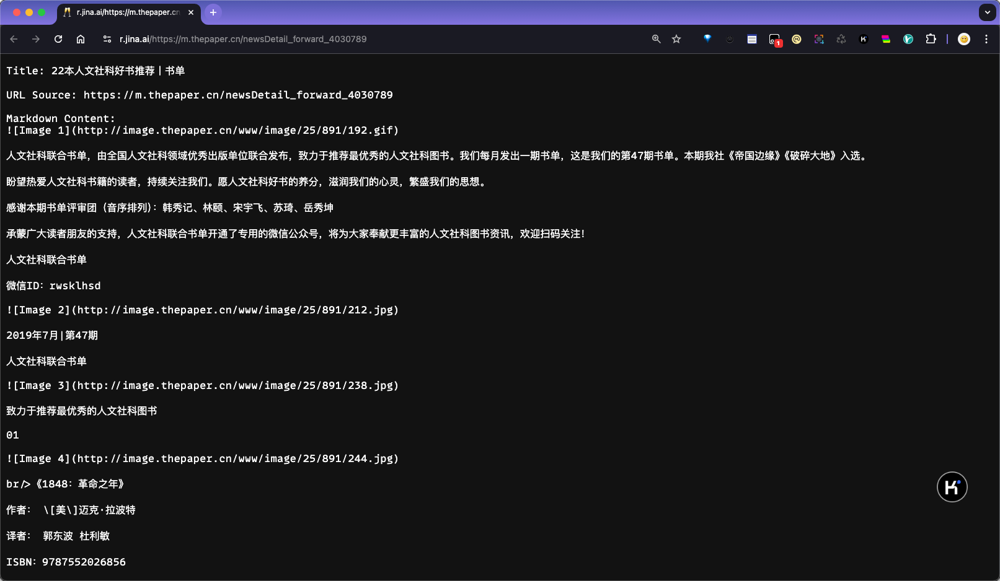

   - 将内容提供给 Agent 进行测试结果输出。
     > 对话 Agent
     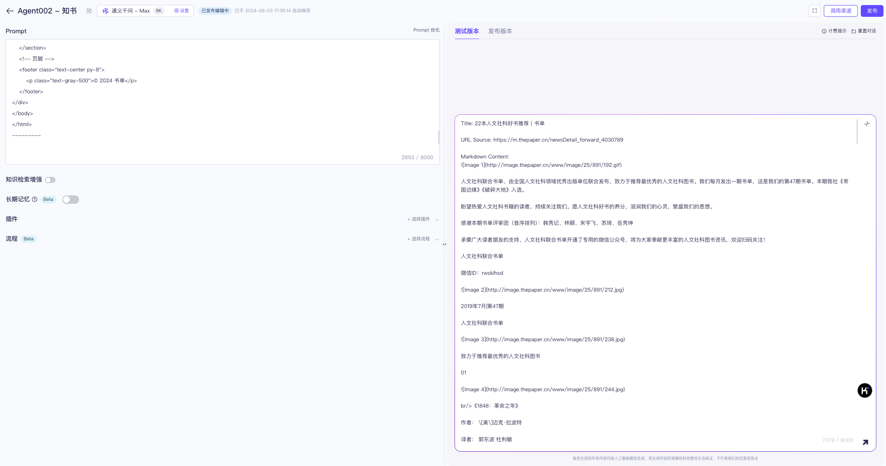
     > Agent 生成结果中
     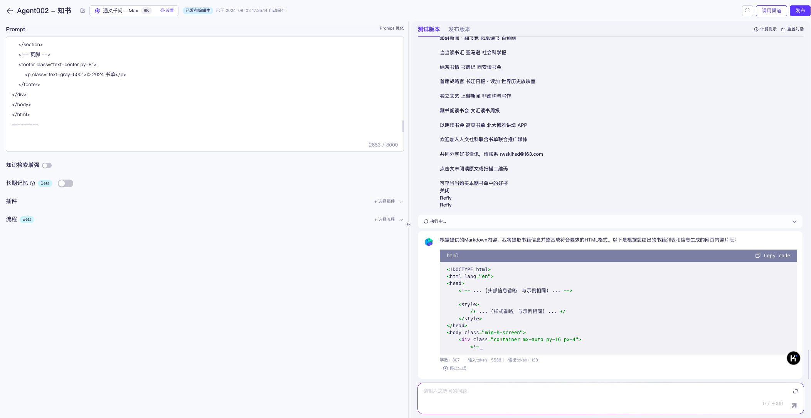
     > 生成最终结果
     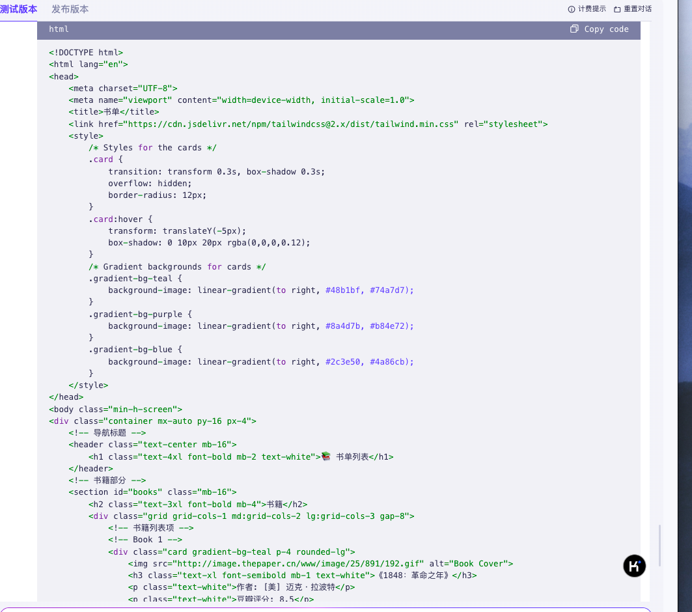

   - 根据结果，进行提示词优化调整。
   - 把返回的 HTML 代码创建文件，使用浏览器访问，生成的内容请查看[知书.html](https://agent361.cn/知书.html)。
     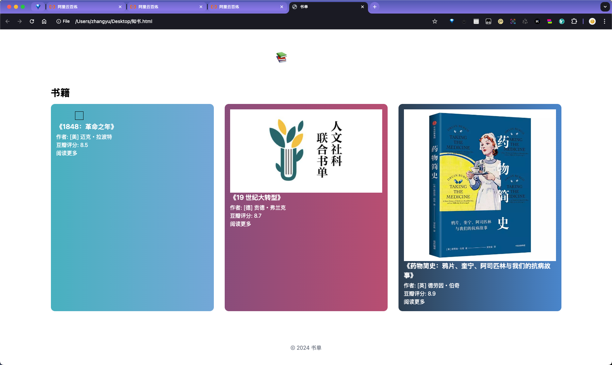

4. **Agent 发布**：
   - 对应用进行测试后，发布 agent，提供可测试渠道页面。
     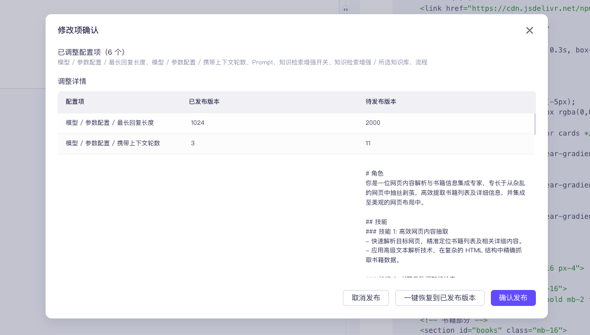
   - 配置调用渠道
     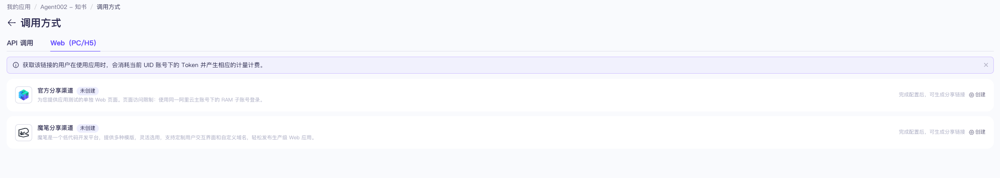
   - API 接口调用
     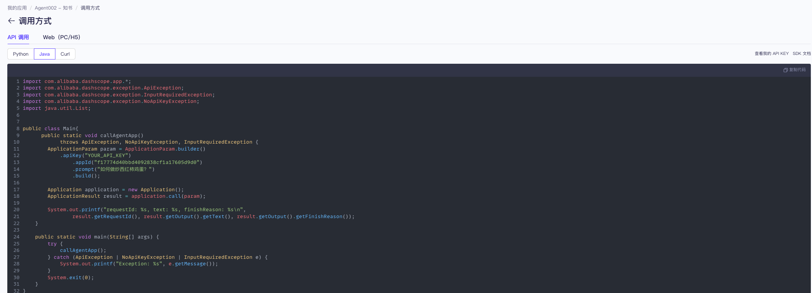
     - 支持 Java、Python、cURL 三种方式，也可以根据自己的编程语言，调用 HTTP 接口。
   - 网页调用（可以快速 POC 演示）
     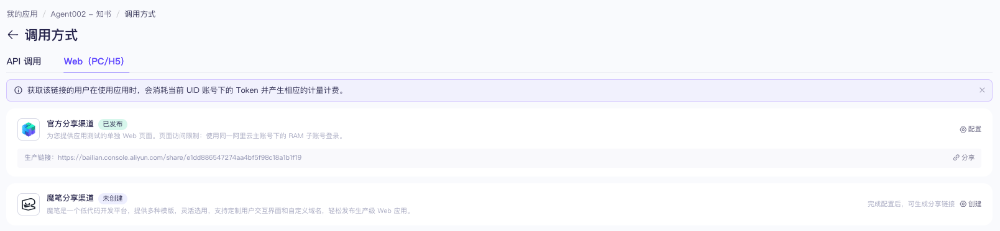

通过以上步骤的操作，完成了为用户提供一个高效、自动化的书籍信息抽取和总结服务，帮助用户快速获取网页中的书单清单。整体流程可以通过配置流程 Agent 实现自动化处理。

## 资源
- [Jina.ai](https://jina.ai/)

## SNS
- 😈 小红书 / 即刻：[@小红书](https://www.xiaohongshu.com/user/profile/66b1bed6000000001d030505) / [@即刻](https://web.okjike.com/u/CA333BB2-2304-4F1E-A2DD-B7BBE4A997B5)
- 🌏 网站-Agent361：https://agent361.cn/
- 🔍 网站-自用导航：https://soul.icu/
- 💰 网站-BillowFlow：https://myinv.cn/
- 📓 网站-笔记：https://mirror.xyz/lua.eth/
