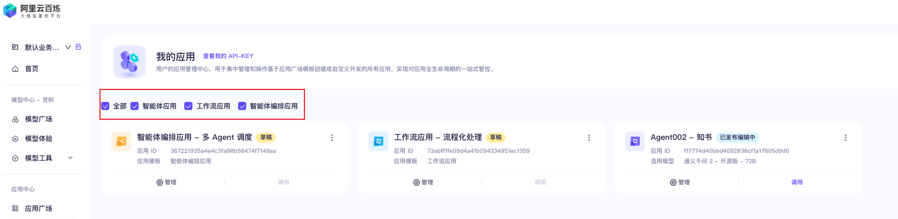

# 📚 🌍 知书-抽取网页中书籍信息

## 前置内容介绍
### [百炼创建应用](https://bailian.console.aliyun.com/#/app-center)
#### 创建应用
##### 应用分类
- [智能体应用](https://help.aliyun.com/zh/model-studio/build-agent-application-in-model-studio)：创建智能体应用，并将 RAG（Retrieval-Augmented Generation，检索增强生成）以及插件能力集成进来。应用创建完成后，您可以通过控制台或 API 的方式来使用。
- [工作流应用](https://help.aliyun.com/zh/model-studio/create-workflow-application)：工作流应用将复杂的任务拆分成一系列有序执行的步骤，以降低系统复杂度。
- [智能体编排应用](https://help.aliyun.com/zh/model-studio/create-agent-orchestration-application)：智能体编排应用可以帮助您构建一个多智能体群组，通过各个智能体之间的分工协作来帮助您高效地处理复杂的任务。

#### 通用智能体内容配置
##### 配置提示词
##### 添加知识库内容
##### 添加插件
##### 添加流程
##### 配置长期记忆
##### 配置输出结果
了解以上的基础知识和流程，接下来，我们就可以创建第一个 Agent 了。

## “知书” Agent 核心能力：
- 自动抽取网页内容中尽可能的书籍信息。
- 扩展书籍的元数据并提供详细的介绍，生成书单。

## 功能点拆分功能：
1. **网页内容解析插件**：解析网页文本，识别书籍相关信息，调用 **Jina** 接口。
2. **提示词配置**：设置大模型角色、能力、约束，用于高效分析网页中的书籍内容。
3. **搜索引擎调用**：利用**夸克搜索引擎**API获取更全面的书籍信息。
4. **书籍内容获取**：从网页和搜索引擎结果中提取书籍的详细信息。
5. **元数据扩展**：自动补充书籍的ISBN、摘要、评论和评分等元数据。
6. **目录总结**：自动提取并总结书籍的主要目录。
7. **书单生成**：根据用户需求生成个性化书单。

## 搭建步骤：
1. **插件配置**：
   - 配置网页内容解析插件，以识别和抽取书籍信息。
   - 设置提示词，如书名、作者、出版社等，以提高识别准确性。

2. **提示词配置**：
   - 定义一组与书籍相关的关键词和短语，用于快速定位网页中的书籍内容。

3. **调用搜索引擎**：
   - 集成搜索引擎API，用于补充和验证书籍信息。

4. **获取书籍内容**：
   - 从解析的网页内容和搜索引擎结果中提取书籍的详细信息。

5. **进行总结**：
   - 自动总结书籍的元数据和主要目录。

6. **输出网页对应的书单**：
   - 根据抽取和总结的信息，生成书单并提供给用户。

7. **应用创建**：
   - 开发一个前端应用，允许用户输入网页链接或文本，并展示智能代理的处理结果。

8. **应用测试**：
   - 对智能代理和前端应用进行测试，确保功能的正确性和用户体验。

通过以上步骤的操作，完成了为用户提供一个高效、自动化的书籍信息抽取和扩展服务，帮助用户快速获取书籍信息或网页中的书单清单。

## 资源
- jina
- 夸克搜索

## SNS
- 😈 小红书 / 即刻：@阿里云百炼
- 🌏 网站-Agent361 ：https://agent361.cn/
- 🔍 网站-自用导航 ：https://soul.icu/
- 💰 网站-BillowFlow ：https://myinv.cn/
- 📓 网站-笔记 ：https://mirror.xyz/lua.eth/

